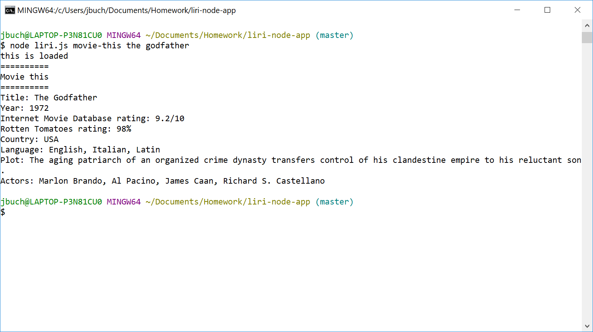
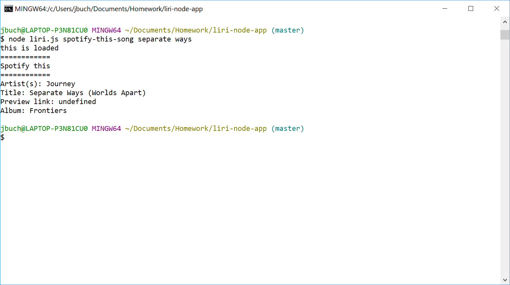

# Liri Bot

## About this Project
This is an app to read, interpret and execute several natural language commands from the CLI. The user can specify the main command (`movie-this` or `spotify-this-song`) along with an additional parameter for certain commands.

## Functions
`movieThis`: Query the Open Movie Database (OMDB) API with a movie title and return complete information about the movie.

`spotifyThisSong`: Query the Spotify API with a song title and return the artist, album and a link to a preview MP3.

Technologies used in this app include Node.js, HTTP Request and Spotify API.

## Screenshots
`movieThis`

`spotifyThisSong`

## Install and Run
Clone the repository to your local machine. Run `npm install` to install the dependencies. Then run `node liri.js` plus the command of your choice (`movie-this` or `spotify-this-song`) with the respective argument (_movie title_ or _song title_).

## Deployed Site
Not applicable, because this is a Node.js CLI app.

## My Portfolio
[https://joseph526.github.io/](https://joseph526.github.io/)